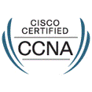
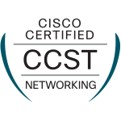

# Winston Santos 
## Junior Network Technician | Junior Cybersecurity Analyst

 Técnico en formación enfocado en **Cybersecurity / Networks / Soporte de Redes (Cisco)**
 
---

 #### 🌍 Madrid, España
 
        winswast@gmail.com 
 
        https://www.linkedin.com/in/winswast

 
---

##  Certificaciones

| Certificación | Emisor | Año | Credencial |
|---|---|---|---|
| CCNA (Cisco Certified Network Associate) | Cisco | 2026 | [Ver credencial](https://www.credly.com/badges/7ddd7eba-3d61-46c0-be75-09634bdd1cff/linked_in_profile) |
| CCST (Cisco Certified Support Technician | Cisco | 2026 | [Ver credencial](https://www.credly.com/badges/89409064-5a69-415d-a521-5a1049b5071f) |
|Google Cybersecurity Proffesional Certificate | Google|  2026| [Ver credencial](https://www.credly.com/badges/ca4c1692-94fc-4a35-b80d-1be999daf782/linked_in_profile) |                        
  
---

##  Laboratorios / Proyectos Prácticos

Tipo | Lab | Descripción | Skills clave |
|---|---|---|---|
| Redes | [Lab01 - Cisco IOS Access Recovery & Factory Reset](https://github.com/Wsantos-IT/Lab01-Cisco-IOS-Access-Recovery_Reset) | Recuperación de acceso IOS y restablecimiento de fábrica en router Cisco | ROMMON, Config-register, IOS CLI |
|Redes | [Lab02 - Fundamentos, Configuracion y Seguridad básica](https://github.com/Wsantos-IT/Lab02-Fundamentos01-Topologia-basica) | Fundamentos, Configuración y Seguridad básica | VLANs, DNS, DHCP, TRUNKING, SSH, CDP |

---

## 📈 Próximos objetivos

- [ ] Agregar Lab03: STP
- [ ] Agregar Lab04: IP Routing

---
 Si te interesa mi trabajo, no dudes en contactarme o revisar mis repositorios.
